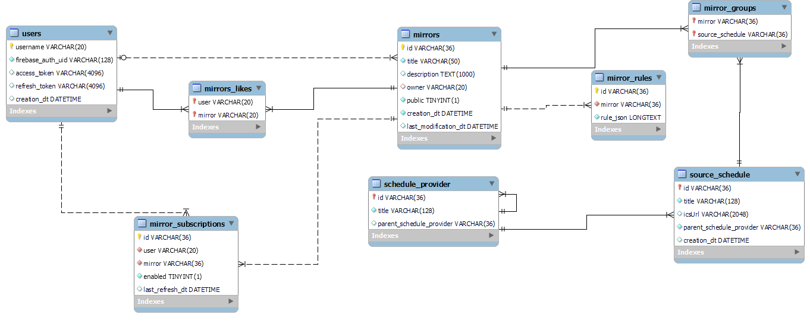

# KAL Api

[![style: very good analysis][very_good_analysis_badge]][very_good_analysis_link]
[![License: MIT][license_badge]][license_link]

This is the backend of the KAL service

The goal is to write everything in Dart. This api uses [Dart Frog](https://dartfrog.vgv.dev), a minimalist backend framework. Firebase Auth will be used for authentication. A [Mysql database](#mysql)

# Api specification

[The Swagger (OpenApi) specification](./swagger.yaml)

## Errors:

### 400 Bad request :

- invalid-username
  - too-long
  - too-short
  - invalid-characters
- invalid-token-id
- invalid-pagination
  - too-many-results
  - search-pattern-too-long
  - invalid-ids
  - too-many-group-leaves
- invalid-resource-id
- invalid-mirror
  - invalid-title
    - too-long-title
    - too-short-title
  - invalid-description
    - too-long-description
  - invalid-group-leaves
    - too-many-group-leaves
    - group-leaf-not-found
    - invalid-group-leaf-id
  - id-mismatch // ID given in the request body doesn't match with the url given in url
  - invalid-visibility-value
- invalid-destination-calendar

- invalid-rule //TODO

### 401 Unauthorized

- authentication-required

### 403 Forbidden

- account-incomplete
- private-resource

### 404 Not found

- user-not-found
- mirror-not-found
- rule-not-found
- destination-calendar-not-found

### 409 Conflict

- username-taken
- account-exists
- mirror-exists
- subscription-exists // trying to subscribe more than once to a mirror
- rule-exists

## Help for the developer

Examples of open source apis for inspiration: https://github.com/public-apis/public-apis

# Mysql

Mysql Workbench is used to model the database. The schema is saved in [kal_mysql.mwb](./kal_mysql.mwb)

[license_badge]: https://img.shields.io/badge/license-MIT-blue.svg
[license_link]: https://opensource.org/licenses/MIT
[very_good_analysis_badge]: https://img.shields.io/badge/style-very_good_analysis-B22C89.svg
[very_good_analysis_link]: https://pub.dev/packages/very_good_analysis
